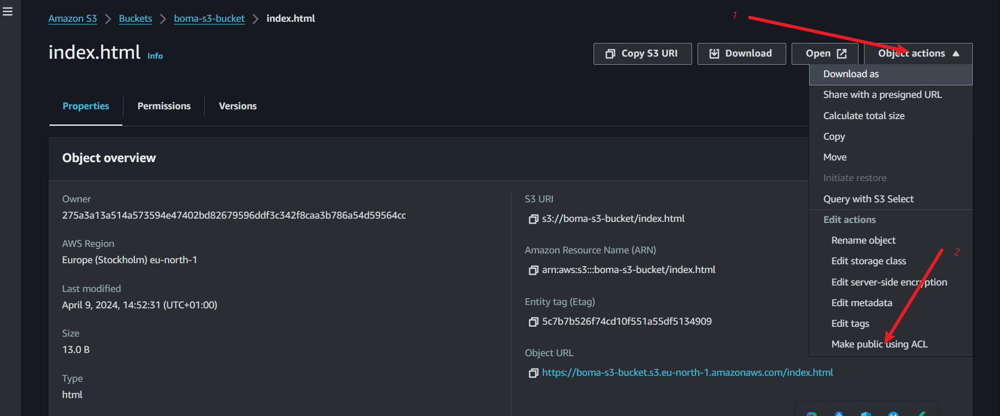
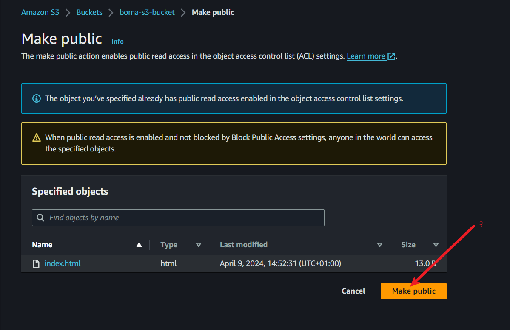

## Suggested adjustment/correction to project 39( Mini project - Single Endpoint Architecture For ec2, foundation 1)

To be able to view object over the internet, ACL, will be allowed at object level (index.html) not just at the bucket level.





**Enabling Static website:**

When asked to enter "username"
username: format: bucket-name.s3.region.amazonaws.com
username: boma-s3-bucket.s3.eu-north-1.amazonaws.com


**Linking mybucket to sites-enabled**

```markdown
ln -s /etc/nginx/sites-available/mybucket /etc/nginx/sites-enabled
```


```markdown
server {
    listen 80;
    server_name 16.171.196.210;  # Replace with your domain name or server IP address

    location / {
        proxy_pass http://boma-s3-bucket.s3-website.eu-north-1.amazonaws.com/index.html; # Replace with the link you generated after you enabled  static website       
	proxy_set_header Host boma-s3-bucket; # Please replace 'bomas-s3-bucket' with your bucket name 
        proxy_set_header X-Real-IP $remote_addr;
        proxy_set_header X-Forwarded-For $proxy_add_x_forwarded_for;
        proxy_set_header X-Forwarded-Proto $scheme;
    }
}
```
Actual changes made to the proxy configuration:

1. **/index.html** added to the **proxy_pass** link

2. **proxy_set_header Host**, only the **bucket name** used here (boma-s33-bucket)